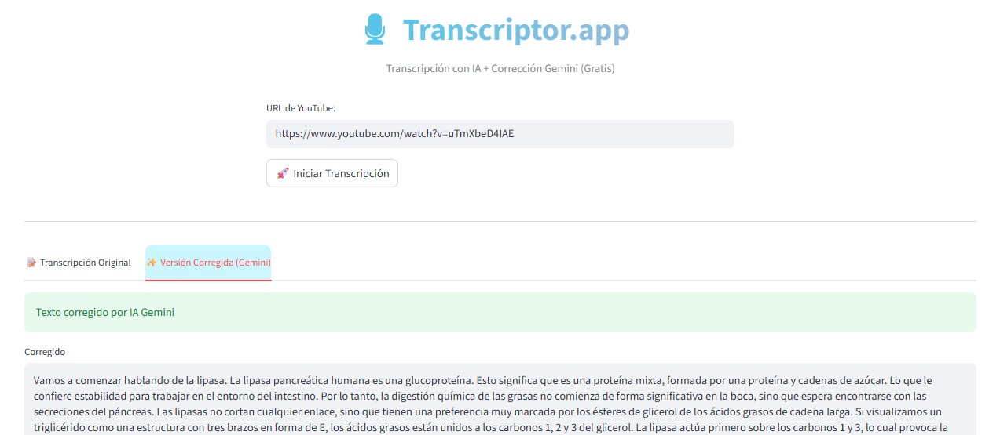

# 🎙️ Transcriptor.app


**Transcriptor.app** es una herramienta desarrollada por **CONFIANZA23 Inteligencia y Seguridad, S.L.** para la extracción y refinamiento de transcripciones de YouTube.



## ✨ Características

- 🚀 **Extracción Inteligente:** Obtén la transcripción completa pegando solo la URL.
- 🧠 **IA Fallback (ASR):** Si el video no tiene subtítulos, la app descarga el audio con `yt-dlp` y lo transcribe usando **OpenAI Whisper**.
- 🪄 **Corrección Gemini:** Una vez obtenida, mejora la legibilidad, puntuación y ortografía del texto usando **Google Gemini** (vía g4f, sin API Key). Sistema robusto con fallback automático a modelos disponibles.
- ⚡ **Optimizado para CPU:** Configuración específica para evitar warnings de FP16 y mejorar el rendimiento.
- 🎨 **Interfaz Premium Estática:** Barra de progreso y mensajes de estado que se actualizan en el mismo lugar (`st.empty()`) para una experiencia limpia.
- 🏢 **Corporate Branding:** Integración visual de la identidad de CONFIANZA23.
- 🌍 **Soporte Multi-idioma:** Soporta transcripciones en español e inglés.
- 📥 **Múltiples Descargas:** Elige entre descargar el texto bruto original o la versión pulida por la IA en TXT, JSON o CSV.

## 📖 Detalle Técnico y Funcionamiento

El producto opera mediante un pipeline de procesamiento secuencial diseñado para la máxima fiabilidad:

### 1. Extracción de Metadatos y Subtítulos
La aplicación utiliza `yt-dlp` para validar la URL y extraer metadatos del video (título, duración). Posteriormente, intenta recuperar los subtítulos oficiales o automáticos a través de la API de transcripciones de YouTube.

### 2. Motor de Fallback ASR (Whisper)
En ausencia de subtítulos, se activa el motor de ASR (Automatic Speech Recognition). El proceso incluye:
- **Descarga Fluida:** `yt-dlp` descarga el audio en formato optimizado, proporcionando feedback en tiempo real (ETA, velocidad) a través de un hook de progreso.
- **Inferencia Local:** Se emplea **OpenAI Whisper** (modelo `base`) configurado para ejecutarse en CPU sin pérdida de precisión sustancial, procesando el audio directamente en un archivo temporal.

### 3. Refinamiento Semántico (Gemini)
El texto en bruto suele carecer de puntuación o tener errores fonéticos. Transcriptor.app utiliza un módulo de "corrección de estilo experto" basado en **Google Gemini**:
- **Zero-Key Access:** Integración con `g4f` para acceder a modelos de lenguaje avanzados sin necesidad de gestionar claves de API.
- **Robustez:** Si el modelo específico falla, el sistema conmuta automáticamente a un modelo de reserva (`g4f.models.default`) para garantizar el servicio.

### 4. UI Dinámica y Persistente
Desarrollado sobre **Streamlit**, el frontend utiliza contenedores `st.empty()` para que las actualizaciones de estado (descarga, transcripción, corrección) ocurran en un único punto visual, evitando el desplazamiento de la página y mejorando la ergonomía de uso.

## ⚠️ Requisito Crítico: FFmpeg

Para que la función de ASR (Whisper) funcione, **debes tener instalado FFmpeg** en tu sistema.
- **Windows:** Descargar desde [ffmpeg.org](https://ffmpeg.org/download.html), descomprimir y añadir la carpeta `bin` al PATH del sistema (o usar `build.cmd` que intenta instalarlo vía `winget`).
- **macOS:** `brew install ffmpeg`
- **Linux:** `sudo apt install ffmpeg`


## 🛠️ Estructura del Proyecto

```text
/transcriptor
│
├── transcriptor.py        # Aplicación principal de Streamlit (UI)
├── requirements.txt       # Dependencias del proyecto
├── README.md              # Documentación
├── build.cmd              # Script de automatización (Windows)
├── skills/                # Módulos lógicos (Skills)
│   ├── youtube_extractor.py  # Extracción de audio y subtítulos
│   ├── gemini_corrector.py   # Corrección IA con Gemini/g4f
│   └── exporters.py          # Generación de TXT, JSON, CSV
└── images/                # Recursos visuales (Logo, Screenshots)
```

## 🚀 Cómo empezar

### 1. Ejecución Rápida (Recomendado en Windows)
Si estás en Windows, simplemente ejecuta el archivo `build.cmd`. Este script:
- Intentará instalar **FFmpeg** automáticamente usando `winget`.
- Instalará todas las librerías de Python necesarias (`pip install -r requirements.txt`).
- Arrancará la aplicación de Streamlit por ti.

```bash
build.cmd
```

### 2. Manual (Cualquier Sistema)
Si prefieres hacerlo paso a paso o estás en otro SO:

```bash
pip install -r requirements.txt
```

### 3. Ejecutar la aplicación
Arranca el servidor de Streamlit con el siguiente comando:
```bash
streamlit run transcriptor.py
```

La aplicación se abrirá automáticamente en tu navegador predeterminado (usualmente en `http://localhost:8501`).

## 📦 Dependencias Principales

- [Streamlit](https://streamlit.io/): Frontend dinámico y premium.
- [yt-dlp](https://github.com/yt-dlp/yt-dlp): Descarga de audio profesional y manejo de metadatos.
- [OpenAI Whisper](https://github.com/openai/whisper): Motor de IA local para transcripción de audio.
- [g4f](https://github.com/xtekky/gpt4free): Acceso a LLMs (Gemini) sin API Keys.
- [YouTube Transcript API](https://pypi.org/project/youtube-transcript-api/): Extracción eficiente de subtítulos existentes.
- [Pandas](https://pandas.pydata.org/): Estructura de datos y exportación multiformato.

---
Desarrollado por **CONFIANZA23 Inteligencia y Seguridad, S.L.** para el proyecto **Act_TSLCB_2026**.
