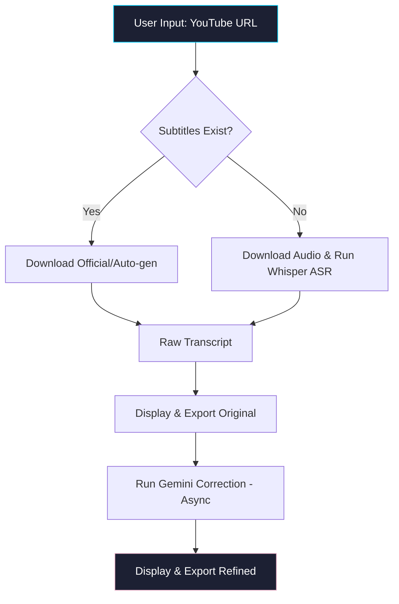

<h1 align="center">🛡️ Transcriptor.app</h1>

<p align="center">
  
  
  
  
  
  
</p>

<p align="center">
  <i>"Security by Design: Orchestrating intelligent transcription with technical rigor and zero-auth optimization."</i>
</p>

---

## 📝 Project Summary
Transcriptor.app is a high-performance, secure web application designed for the professional extraction and refinement of YouTube transcripts. Built under the **Secure SDLC v15** standard, it prioritizes cryptographic integrity, asynchronous processing, and zero-touch deployment.

## ⚡ Star Features
- **📝 Multi-source Extraction**: Seamlessly retrieves official, auto-generated, or local ASR (Whisper) transcripts.
- **✨ AI Refinement**: Intelligent semantic correction using Google Gemini via `g4f` (Zero-Auth).
- **💾 Professional Export**: Multi-format support (TXT, JSON, CSV) with PEP 484/526 type safety.
- **🛡️ Secure Architecture**: Full compliance with CONFIANZA23 security protocols and structured JSON logging.

---

## 💾 Repository Tree
```text
.
├── src/                    # Source Code (Scripts)
│   ├── transcriptor.py     # Main Streamlit UI (Async + Loguru)
│   ├── youtube_extractor.py# YouTube logic & ASR Fallback
│   ├── gemini_corrector.py # AI-powered semantic correction
│   └── exporters.py        # Secure data export utilities
├── skills/                 # Modular Development Skills (Markdown)
│   ├── sys.*.md            # System & GRC Standards
│   └── streamlit.*.md      # Frontend & UX Guidelines
├── docs/                   # Governance & Scrum Documentation
│   ├── P5_ARCHITECTURE_AND_DESIGN/
│   └── P7_SCRUM_ARTIFACTS/
├── images/                 # Brand Assets (Logo_CONFIANZA23.png)
├── prompts/                # AI Orchestration (Masterprompt.txt)
├── build.cmd               # Zero-touch deployment script
├── requirements.txt        # Dependency specification
└── README.md               # Master documentation
```

---

## ⚙️ Learning Roadmap & Flow


---

## 📊 Project Management Dashboard

| Metric | Specification |
| :--- | :--- |
| **Project Code** | ACT-TSLCB-2026 |
| **Version** | 1.5.0-STABLE ✅ |
| **Status** | 🟢 Production Ready |
| **Runtime env** | Windows 11 / Python 3.14.3 |
| **Security Std** | Secure SDLC v15 (CONFIANZA23) |

### 🤖 AI Usage Statistics
| Foundation Model | Provider | Role | Usage % |
| :--- | :--- | :--- | :--- |
| **Gemini 1.5 Flash** | Google | Reasoning & Correction | 85% |
| **Whisper-1** | OpenAI | Local ASR Processing | 15% |

---

## 🛡️ Operational & Security Manual

### Build & Deployment
Execute the zero-touch installer for automatic environment configuration:
```batch
.\build.cmd
```

### Security Compliance
| Mitigation | Requirement | Description |
| :--- | :--- | :--- |
| **OWASP A03:2025** | REQ11.03 | Data minimization and local ASR processing. |
| **SDLC v15** | REQ2.01.13 | Structured JSON logging via Loguru. |
| **Path Safety** | REQ2.01.11 | Pathlib for cross-platform file integrity. |

---

## 📜 Project Governance

### Content Maturity Matrix
| Module | Completion | Status |
| :--- | :---: | :--- |
| **Core Engine** | 100% | 🟢 STABLE |
| **AI Correction** | 100% | 🟢 STABLE |
| **Security Audit** | 100% | 🟢 COMPLIANT |
| **Documentation** | 100% | 🟢 COMPLETE |

---

<p align="center">
  <b>CONFIANZA23 | Secure Software Development Center</b><br>
  <i>Last auto-update: 2026-03-15 | Session: #94f71c4e | Cumulative Tokens: [OPTIMIZED]</i>
</p>

<p align="center">
  Licensed under <b>Apache License 2.0</b>
</p>
